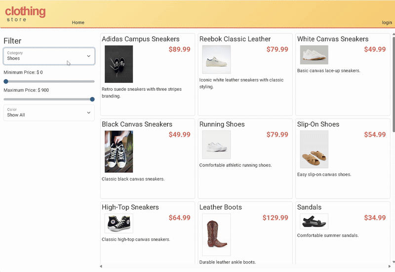

# Clothing Store

## Description of the Project

This project is a Spring Boot E-Commerce API developed for Capstone 3.
It serves as the backend for an online Clothing Store, allowing users to browse products, filter by category, manage a shopping cart, and place orders.

The API connects to a MySQL database and is consumed by an existing frontend web application. The primary goal of this project is to fix existing bugs, add new backend features, and ensure the API functions correctly through testing with Insomnia.

## User Stories

- As a shopper, I want to view all clothing products so that I can browse what the store offers.

- As a shopper, I want to filter products by category so that I can quickly find what I’m looking for.

- As a shopper, I want to add items to my cart so that I can purchase multiple products at once.

- As a shopper, I want to place an order so that I can complete my purchase.

- As a developer, I want the API to return clear error messages so that issues can be easily identified and fixed.

## Setup

Instructions on how to set up and run the project using IntelliJ IDEA.

### Prerequisites

- IntelliJ IDEA: Ensure you have IntelliJ IDEA installed, which you can download from [here](https://www.jetbrains.com/idea/download/).
- Java SDK: Make sure Java SDK is installed and configured in IntelliJ.

### Running the Application in IntelliJ

Follow these steps to get your application running within IntelliJ IDEA:

1. Open IntelliJ IDEA.
2. Select "Open" and navigate to the directory where you cloned or downloaded the project.
3. After the project opens, wait for IntelliJ to index the files and set up the project.
4. Configure the database connection in application.properties.
5. Find the main class with the `public static void main(String[] args)` method.
6. Right-click on the file and select 'Run 'YourMainClassName.main()'' to start the application.

## Technologies Used

- Java 17
- Spring Boot
- MySQL
- Insomnia

## Demo

## Future Work

- Refactoring and addition of service classes for shopping cart and order.
- Addition of a cart for liked items or refactoring current one.
- Addition of keyword search feature.
- Addition of unit tests.

## Resources

List resources such as tutorials, articles, or documentation that helped you during the project.

- [Potato Sensei](https://chatgpt.com/g/g-681d378b0c90819197b16e49abe384ec-potato-sensei)
- PluralSight Workbooks

## Team Members

- Tamir, developer 

## Thanks

- Thank you to Potato Sensei for continuous support and guidance.
- A special thanks to Roger Siuu.
